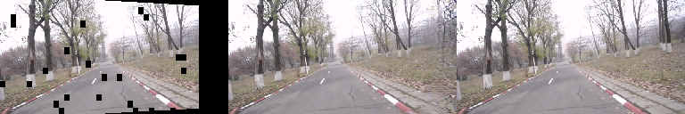
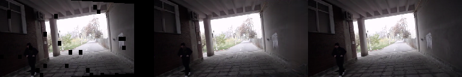
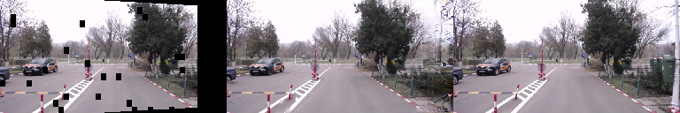
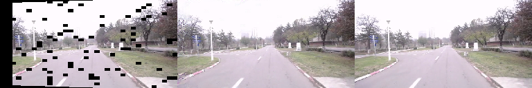

# Inpaint PConv - UPB

<<<<<<< HEAD
<p align="center">
	
</p>

<p align="center">
	
</p>

<p align="center">
	
</p>

<p align="center">
	
</p>


## Pre-requisite
```shell
mkdir -p snapshots/ckpt/
cd snapshots/ckpt/
```

Download a pre-trained module on nuScenes from <a href="https://drive.google.com/drive/folders/1PgYO_5Z8z8heR4jA-6PmODHOf259z0RX?usp=sharing">here</a>.

=======

## Pre-requisite
```shell
mkdir -p snapshots/ckpt/
cd snapshots/ckpt/
```

Download a pre-trained module on nuScenes from <a href="https://drive.google.com/drive/folders/1PgYO_5Z8z8heR4jA-6PmODHOf259z0RX?usp=sharing">here</a>.

>>>>>>> e35c2c0e960a5c8f87c38e4a2a124348cacbe691
```shell
mkdir -p pipeline/models/monodepth
cd pipeline/models/monodepth
```

Download monodepth pre-treained module from <a href="https://drive.google.com/drive/folders/18kTR4PaRlQIeEFJ2gNkiXYnFcTfyrRNH?usp=sharing">here</a>.

## Create dataset

```shell
mkdir raw_dataset
```

* Download the UBP dataset into the "raw_dataset" directory. A sample of the UPB dataset is available <a href="https://drive.google.com/drive/folders/1p_2-_Xo-Wd9MCnkYqPfGyKs2BnbeApqn?usp=sharing">here</a>. Those video are 3FPS. Consider downloding the original dataset and downsample to 10FPS.

```shell
mkdir scene_splits
```

* Download the scene splits into the "scene_splits" directory. The train-validation split is available <a href="https://github.com/RobertSamoilescu/UPB-Dataset-Split">here</a>.
In the "scene_splits" directory you should have: "train_scenes.txt" and "test_scenes.txt".

* Create images, masks, depth maps

```shell
python3 scripts/dataset_constructor.py \
	--src_folder raw_dataset \
	--dst_folder dataset \
```

* Split dataset
``` shell
python3 scripts/split_dataset.py
```

## Train model

```shell
python3 train.py \
	--resume snapshots/ckpt/1000000.pth \
	--max_iter 1500000 \
	--lr 2e-5
```

Freez layers 

```shell
python3 train.py \
	--finetune \
	--max_iter 2000000 \
	--resume snapshots/ckpt/1500000.pth \
	--lr_finetune 5e-6
```

## Test model

Compute L1, PSNR, SSIM
```shell
python3 scores.py --model 2000000.pth
```

View inpainting results
```shell
<<<<<<< HEAD
python3 scripts/test_model.py --model 2000000.pth
=======
python3 scripts/results.py --model 2000000.pth
>>>>>>> e35c2c0e960a5c8f87c38e4a2a124348cacbe691
```

## Pre-trained model on UPB
A pretrained model is available <a href="https://drive.google.com/drive/folders/1oeVxVnR5BIZ1QM-ClY6Xa4CogxTQzmZx?usp=sharing">here</a>.